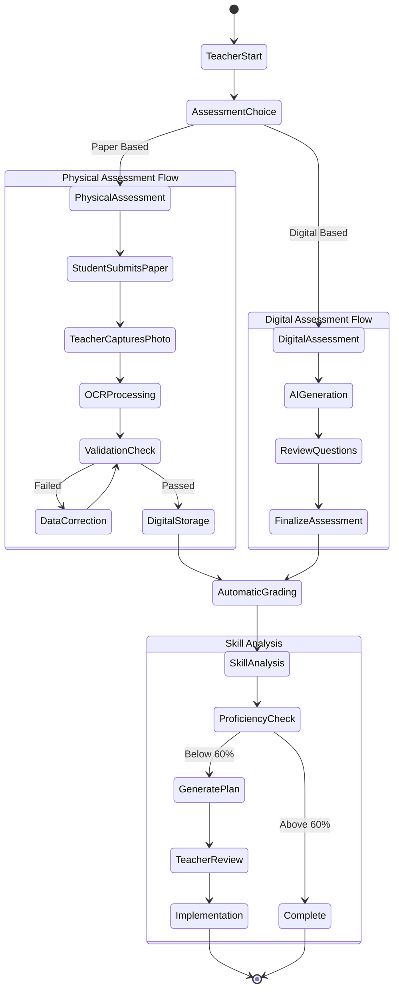

```mermaid
stateDiagram-v2
    [*] --> TeacherStart
    
    TeacherStart --> AssessmentChoice
    AssessmentChoice --> PhysicalAssessment: Paper Based
    AssessmentChoice --> DigitalAssessment: Digital Based
    
    state "Physical Assessment Flow" as PhysicalFlow {
        PhysicalAssessment --> StudentSubmitsPaper
        StudentSubmitsPaper --> TeacherCapturesPhoto
        TeacherCapturesPhoto --> OCRProcessing
        OCRProcessing --> ValidationCheck
        
        ValidationCheck --> DataCorrection: Failed
        DataCorrection --> ValidationCheck
        ValidationCheck --> DigitalStorage: Passed
    }
    
    state "Digital Assessment Flow" as DigitalFlow {
        DigitalAssessment --> AIGeneration
        AIGeneration --> ReviewQuestions
        ReviewQuestions --> FinalizeAssessment
    }
    
    DigitalStorage --> AutomaticGrading
    FinalizeAssessment --> AutomaticGrading
    
    AutomaticGrading --> SkillAnalysis
    
    state "Skill Analysis" as SkillCheck {
        SkillAnalysis --> ProficiencyCheck
        ProficiencyCheck --> GeneratePlan: Below 60%
        ProficiencyCheck --> Complete: Above 60%
        GeneratePlan --> TeacherReview
        TeacherReview --> Implementation
    }
    
    Implementation --> [*]
    Complete --> [*]
```