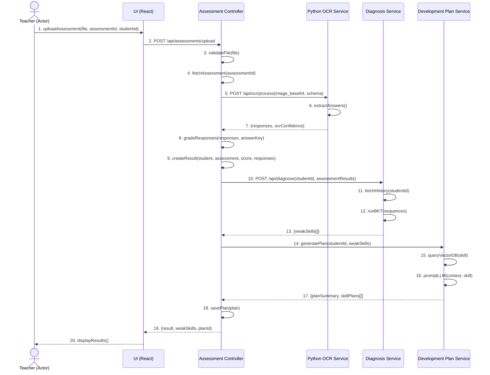

```mermaid


sequenceDiagram
    actor Teacher as Teacher (Actor)
    participant UI as UI (React)
    participant AC as Assessment Controller
    participant OCR as Python OCR Service
    participant DX as Diagnosis Service
    participant DP as Development Plan Service

    Teacher ->> UI: 1. uploadAssessment(file, assessmentId, studentId)
    UI      ->> AC: 2. POST /api/assessments/upload

    AC      ->> AC: 3. validateFile(file)
    AC      ->> AC: 4. fetchAssessment(assessmentId)

    AC      ->> OCR: 5. POST /api/ocr/process(image_base64, schema)
    OCR     ->> OCR: 6. extractAnswers()
    OCR     -->> AC: 7. {responses, ocrConfidence}

    AC      ->> AC: 8. gradeResponses(responses, answerKey)
    AC      ->> AC: 9. createResult(student, assessment, score, responses)

    AC      ->> DX: 10. POST /api/diagnose(studentId, assessmentResults)
    DX      ->> DX: 11. fetchHistory(studentId)
    DX      ->> DX: 12. runBKT(sequences)
    DX      -->> AC: 13. {weakSkills[]}

    AC      ->> DP: 14. generatePlan(studentId, weakSkills)
    DP      ->> DP: 15. queryVectorDB(skill)
    DP      ->> DP: 16. promptLLM(context, skill)
    DP      -->> AC: 17. {planSummary, skillPlans[]}

    AC      ->> AC: 18. savePlan(plan)
    AC      -->> UI: 19. {result, weakSkills, planId}
    UI      -->> Teacher: 20. displayResults()
```