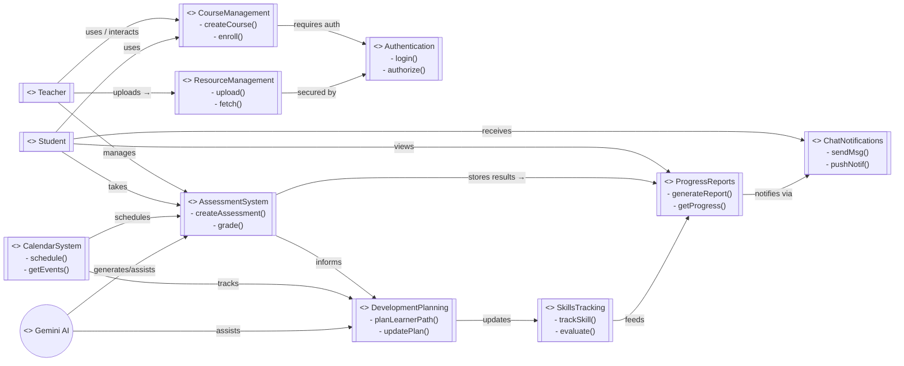

```mermaid

%% UML-style component diagram (Mermaid)
graph LR
  %% Actors (stereotypes)
  Teacher[[<<Actor>> Teacher]]
  Student[[<<Actor>> Student]]

  %% Components (stereotypes)
  AuthComp[["<<Component>> Authentication\n- login()\n- authorize()"]]
  ResourceComp[["<<Component>> ResourceManagement\n- upload()\n- fetch()"]]
  CourseComp[["<<Component>> CourseManagement\n- createCourse()\n- enroll()"]]
  AssessComp[["<<Component>> AssessmentSystem\n- createAssessment()\n- grade()"]]
  DevPlanComp[["<<Component>> DevelopmentPlanning\n- planLearnerPath()\n- updatePlan()"]]
  SkillsComp[["<<Component>> SkillsTracking\n- trackSkill()\n- evaluate()"]]
  ProgressComp[["<<Component>> ProgressReports\n- generateReport()\n- getProgress()"]]
  ChatComp[["<<Component>> ChatNotifications\n- sendMsg()\n- pushNotif()"]]
  CalendarComp[["<<Component>> CalendarSystem\n- schedule()\n- getEvents()"]]

  %% External Service
  Gemini((<<External>> Gemini AI))

  %% Actor → Component
  Teacher -->|uses / interacts| CourseComp
  Teacher -->|manages| AssessComp
  Teacher -->|uploads →| ResourceComp
  Student -->|uses| CourseComp
  Student -->|takes| AssessComp
  Student -->|views| ProgressComp
  Student -->|receives| ChatComp

  %% Component relationships
  CourseComp -->|requires auth| AuthComp
  ResourceComp -->|secured by| AuthComp
  AssessComp -->|stores results →| ProgressComp
  AssessComp -->|informs| DevPlanComp
  DevPlanComp -->|updates| SkillsComp
  SkillsComp -->|feeds| ProgressComp
  ProgressComp -->|notifies via| ChatComp
  CalendarComp -->|schedules| AssessComp
  CalendarComp -->|tracks| DevPlanComp

  %% External links
  Gemini -->|generates/assists| AssessComp
  Gemini -->|assists| DevPlanComp


```